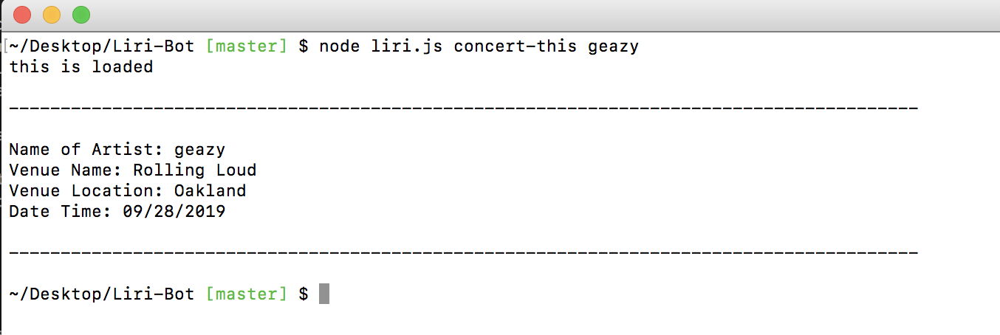

# Title: Liri-Bot
## Site Picture:
 
 


## Technologies Used:
- Javascript: This is the primamy house that holds even my node.js technology itself. This is the main technology to render the game.
- Node.JS: An open-source,cross-platform JavaScript runtime enviroment designed to be run outside of browsers-in this case my command terminal.
- moment.js: Used to convert and manipulare the date/time conversions within the application so it is readable for the user.

## Summary:
    I created an similar application to Apple's SIRI application--a Speech Interpretation and Recognition Interface. My LIRI application is a Language Interpretation and Recognition Interface. Liri is ran mainly on the command terminal node app that would get (.get) through a series of parameter values and append back the user data they requested specifically. In terms of what online repositories that were opened-sourced for publishing node.js project specifically by allowing me to incorporate pre-made snippits (AKA Node Package Managers) into my application specifically were: Axios, DotEnv, moment, Spotify and filesystem. 

## Code Snippet:
```html
<body>
    <script>
        //read and set any environment variables with the dotenv package
require("dotenv").config();
//import the keys.js file and stores it in 'keys' variable
var keys = require("./keys.js");

//access to my personal spotify api information
var Spotify = require("node-spotify-api");
//access to my personal spotify api information
var spotify = new Spotify(keys.spotify);

//-----------------------NPM Access--------------------------------------------------------------------------------------------------------------------------
//access to the core node packafe to filesystem...for readi/writing files (used here for mainly the Do-What-It-Says portion)
var fs = require("fs");
//include the axios npm package stored within 'axios' variable
var axios = require("axios");
//include the moment npm package stored within 'moment' variable
var moment = require('moment');


//--------------------Global Variables----------------------------------------------------------------------------------------------------------------------
var render = process.argv[2];
var search = process.argv[3];


//------------------------main renderments of liri.js--------------------------------------------------------------------------------------------------------
//renders the operand the user has selected
switch (render) {
    case "concert-this":
        renderBandsInTown(search)
        break;
    case "movie-this":
        renderMovieThis(search)
        break;
    case "do-what-it-says":
        renderDoWhatItSays();
        break;
    case "spotify-this-song":
        renderSpotifyThisSong(search);
        break;
    default:
        console.log("Error! Your command is not valid in Liri--try again, please!");

}

// ---------------------Concert_This: Bands In Town portion--------------------------------------------------------------------------------------------------
function renderBandsInTown() {

    //jQuery bandsintown api for the selected title artist
    var bandsUrl = "https://rest.bandsintown.com/artists/" + search + "/events?app_id=codingbootcamp"
    //axios get request to 'bandsUrl'
    axios.get(bandsUrl)
        //promises with .then to run this function if/when axios is ran above in getting the API of bandsUrl link ref
        .then(function (response) {
            var titleVenue = response.data[0].venue.name;
            var locationVenue = response.data[0].venue.city;
            var dateTimeVenue = response.data[0].datetime;

            console.log("\n----------------------------------------------------------------------------------------\n");
            console.log("Name of Artist: " + search +
                "\nVenue Name: " + titleVenue +
                "\nVenue Location: " + locationVenue +
                // used moment within this line below to format the time to 'mm/dd/yyyy'
                "\nDate Time: " + moment(dateTimeVenue).format("MM/DD/YYYY"));
            console.log("\n----------------------------------------------------------------------------------------\n");
        })
        .catch(function (error) {
            if (error.response) {
                console.log(error.response.name);
                console.log(error.response.status);
                console.log(error.response.headers);
            }
            else if (error, request) {
                //'error.request' is an object that comes back with details pertaining to the error that occured in receiving the request
                console.log(error.request);
            }
            else {
                //message the user that something happened in setting up the request that triggered an Error
                console.log("Error", error.message);
            }
            console.log(error.config);
        });
};


// ----------------Movie_This: OMDb portion-----------------------------------------------------------------------------------------------------------------
function renderMovieThis() {
    //If the user doesn't type a movie in, the program will output data for the movie 'Mr. Nobody.'
    if(!search) {
        search = "mr.nobody";
    }

    //'omdbUrl' variable to hold the url link to my OMDb API key & logging the responses to the console
    var omdbUrl = "https://www.omdbapi.com/?t=" + search + "&y=&plot=short&apikey=9e558ee4";

    //axios get request to 'omdbUrl'
    axios.get(omdbUrl)
        //promises with .then to run this function if/when axios is ran above in getting the API of omdbUrl link ref
        .then(function (response) {
            var movieReleaseDate = response.data.Year;
            var movieImdbRating = response.data.imdbRating;
            var movieTomatoesRating = response.data.Ratings[1].Value;
            var movieCountryProduction = response.data.Country;
            var movieLanguage = response.data.Language;
            var moviePlot = response.data.Plot;
            var movieActors = response.data.Actors;
            console.log("\n----------------------------------------------------------------------------------------\n");
            console.log("Title of the movie: " + search + "\nYear Movie Released: "
                + movieReleaseDate + "\nIMDB Rating: " + movieImdbRating +
                "\nRotten Tomatoes Rating: " + movieTomatoesRating + "\nLocation of Movie Production: "
                + movieCountryProduction + "\nLanguage of Movie: " + movieLanguage
                + "\nMovie Plot: " + moviePlot + "\nActors in Movie: " + movieActors);
            console.log("\n----------------------------------------------------------------------------------------\n");

        })
        // If the code experiences any errors it will log the error to the console.
        .catch(function (error) {
            if (error.response) {
                console.log(error.response.name);
                console.log(error.response.status);
                console.log(error.response.headers);
            }
            else if (error.request) {
                console.log(error.request);
            }
            else {
                console.log("Error", error.message);
            }
            console.log(error.config);
        });
};


// ------------------Do What It Says portion-------------------------------------------------------------------------------------------------

function renderDoWhatItSays() {
    // The code will store the contents of the reading inside the variable "data" callback function
    // line 94 will begin starting to read from the file "random.txt"...'utf8' will construct the text it writes in random.txt as actually letters that we can read/understand
    fs.readFile("random.txt", "utf8", function (error, data) {
        // If the code experiences any errors it will log the error to the console.
        if (error) {
            return console.log(error);
        }
        // We will then print the contents of data
        console.log(data);
        // Then split it by commas (to make it more readable)
        var dataArr = data.split(",");

        for (var j = 0; j < dataArr.length; j++) {
            //if the array index is an even number...
            if (j % 2 ===0) {
                //store the value under the 'render' global variable
                render = dataArr[j];
            }
            else {
                //else, the stored value is an odd number and is stored under the 'search' global variable
                search = dataArr[j];
            }
        };


    })
};


//------------------Spotify This Song portion------------------------------------------------------------------------------------------------
function renderSpotifyThisSong() {

    //If no song is provided then your program will default to "The Sign" by Ace of Base.
    if (!search) {
        search = "The+Sign";
    }

    spotify.search({ type: "track", query: search }, function (err, response) {
        // If the code experiences any errors it will log the error to the console.
        if (err) {
            return console.log("Error: " + err);
        }

        var renderSong = response.tracks.items;

        // Artist(s) output
        console.log("Artist(s): " + renderSong[0].artists[0].name +
            // The song's name output
            "\nSong Name: " + renderSong[0].name +
            // A preview link of the song from Spotify output
            "\nPreview Link: " + renderSong[0].preview_url +
            // The album that the song is from
            "\nAlbum: " + renderSong[0].album.name);
    });
}
    </script>
</body>
  
```


## Author Links:
[GitHub](https://github.com/duongsters)
[LinkIn]()